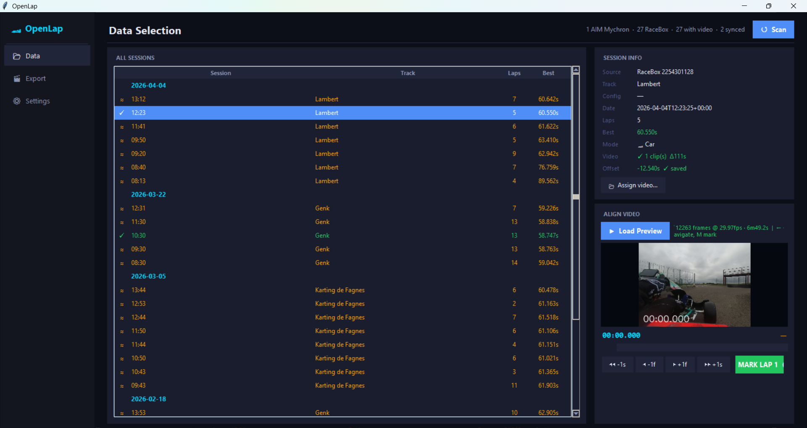
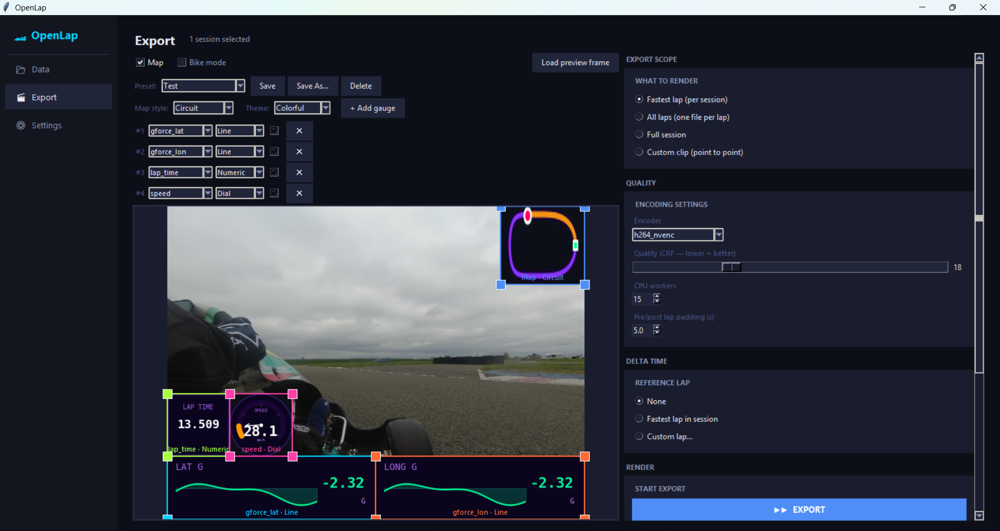
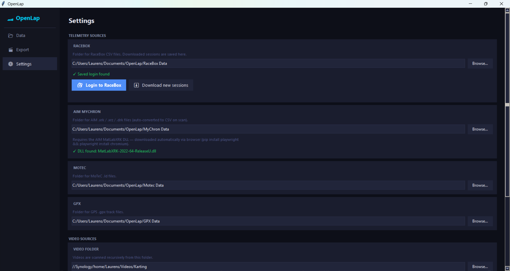

# OpenLap

**OpenLap** is an open-source desktop application that overlays telemetry data on racing video footage. Point it at your telemetry files and a folder of videos, and it matches sessions, syncs timing, and renders professional-looking gauge overlays — all from a single window.

> Licensed under the **GNU General Public License v3**. Free forever. Forks must stay open source.

---

## Preview

**Sample output video** — Karting Haute Picardie Arvillers:

[](https://www.youtube.com/watch?v=0XuByCyL_mA)

### Screenshots

| Data | Export | Settings |
|---|---|---|
|  |  |  |

---

## Features

### Data & Session Management
- Per-source telemetry folders — configure separate directories for RaceBox, AIM, MoTeC, and GPX data
- Scan folders recursively to discover sessions and automatically match them to video files
- Manual video reassignment for sessions where auto-matching doesn't find the right clip
- Multi-clip support — assign several video segments to a single session; they are joined before rendering
- Frame-accurate sync tool with persistent offsets: set once, remembered forever per file
- RaceBox cloud download directly from the app (requires a RaceBox account)
- AIM `.xrk` / `.xrz` / `.drk` files are silently converted to CSV on first scan using the AIM MatLabXRK DLL (downloaded automatically)

### Overlay Editor
- Individual, freely positionable gauge elements — each channel is its own resizable box
- **Element-to-element snapping**: edges and centres of gauge boxes snap to each other with cyan alignment guides
- **Size grid snapping**: width and height snap to 5% increments during resize for consistent sizing
- Snap to screen edges on release
- Live style previews update as you drag and resize
- **4 overlay themes**: Dark · Light · Colorful · Monochrome — applied to all gauges and the map simultaneously
- **6 gauge styles**: Numeric · Bar · Dial · Line · Lean · Delta
- **1 map style**: Circuit (overhead trace with driven-portion highlight and position dot)
- Bike mode — enables Lean gauge style and reads LeanAngle from compatible devices
- Named preset layouts — save, load, and delete overlay configurations
- Load a real video frame as a background for accurate overlay placement

### Export
- **Scope**: Fastest Lap, All Laps (one file per lap), or Full Session
- GPU-accelerated encoding with auto-detection: NVENC (NVIDIA) · AMF (AMD) · QSV (Intel) · libx264 (CPU fallback)
- Adjustable quality (CRF) and CPU worker count
- Configurable pre/post lap padding (seconds)
- Progress bar and log output during render

### Extensibility
- Plugin-based style system — drop a `.py` file into `styles/` and it appears in the UI with no registration
- All styles receive theme colour tokens so custom styles automatically support all four themes

---

## Supported Data Sources

| Source | File types | Notes |
|---|---|---|
| **RaceBox** | `.csv` (RaceBox format) | Car and bike mode; auto-detected from column layout |
| **AIM Mychron** | `.xrk` · `.xrz` · `.drk` | Auto-converted to CSV on scan; AIM DLL downloaded automatically on first use |
| **MoTeC** | `.ld` | Binary i2 format; full session lap timing + last-lap telemetry from circular buffer |
| **GPX** | `.gpx` | GPS track files; speed derived from position + timestamp |

### Telemetry channels

| Channel | Label | Unit | Symmetric |
|---|---|---|---|
| `speed` | Speed | km/h | No |
| `rpm` | RPM | rpm | No |
| `exhaust_temp` | Exhaust Temp | °C | No |
| `gforce_lon` | Long G | G | Yes |
| `gforce_lat` | Lat G | G | Yes |
| `lean` | Lean | ° | Yes (bike only) |
| `lap_time` | Lap Time | s | No |
| `delta_time` | Delta | s | Yes |

---

## Installation

### Requirements

- **Python 3.10+**
- **FFmpeg** available on your system `PATH`
- Python packages:

```bash
pip install opencv-python pillow numpy matplotlib
```

For AIM `.xrk` conversion and MoTeC `.ld` parsing:

```bash
pip install pandas
```

For RaceBox cloud download (optional):

```bash
pip install playwright
playwright install chromium
```

### Running

Double-click `openlap.pyw`, or from a terminal:

```bash
python openlap.pyw
```

Configuration is stored at `~/.openlap/config.json` and migrated automatically from older locations on first run.

---

## Usage

### 1. Settings tab

Configure separate folders for each telemetry source, your **Video Folder**, and **Export Folder**. All paths are remembered between sessions.

- **RaceBox** — set the folder where CSVs are stored; log in to download new sessions from the cloud directly into that folder
- **AIM Mychron** — point at the folder containing `.xrk` / `.xrz` / `.drk` files; conversion to CSV happens automatically on the next scan
- **MoTeC** — point at the folder containing `.ld` files
- **GPX** — point at the folder containing `.gpx` files

> **Migrating from an older version?** If you had a single "Telemetry Folder" set, a **Legacy Folder** card appears at the bottom of the Telemetry Sources section with a **Clear** button. Set the per-source paths first, then clear the legacy folder to remove duplicates from the session list.

### 2. Data tab

Click **Scan** to discover sessions and match them to video files (also runs automatically on startup).

- Sessions appear in a tree grouped by date
- Click a session row to expand its lap list
- Use **Reassign Video** to manually link a session to a specific video file or set of clips
- Use the **Align Video** panel to sync telemetry with the video:
  - Scrub the preview to the moment the lap timer starts
  - Press **M** (or click **Mark**) to lock the sync offset
  - The offset is saved immediately to `config.json` and restored on next launch

### 3. Export tab

#### Overlay layout

1. **Add Gauge** — choose a channel and style; a new element appears on the canvas
2. **Drag** elements to reposition; **drag a corner handle** to resize
   - Elements snap to each other's edges and centres (cyan guide lines show active snaps)
   - Size snaps to 0.05 increments — two G-force bars will always align perfectly
3. Choose a **Map style** (Circuit) and toggle the map on/off
4. Pick an **overlay theme** (Dark · Light · Colorful · Monochrome)
5. Save the layout as a named **Preset**, or load/delete existing ones

#### Export

1. Select sessions in the **Data** tab, then come back to **Export**
2. Choose scope: **Fastest Lap**, **All Laps**, or **Full Session**
3. Tune encoder, quality (CRF), worker count, and padding as needed
4. Click **▶▶ EXPORT**

---

## Overlay Themes

| Theme | Background | Fill colours | Best for |
|---|---|---|---|
| **Dark** | Semi-transparent black | Cyan · Amber | Night footage, dark cockpits |
| **Light** | Semi-transparent white | Deep blue · Orange | Bright daylight footage |
| **Colorful** | Deep purple | Magenta · Green · Orange | Stylised / highlight edits |
| **Monochrome** | Black | White · Grey | Clean, minimal look |

---

## Gauge Styles

| Style | Description |
|---|---|
| **Dial** | Circular arc gauge with needle; 240° sweep |
| **Bar** | Horizontal fill bar; symmetric channels fill from centre with left/right colours |
| **Numeric** | Large centred value readout |
| **Line** | Scrolling area chart of recent history |
| **Lean** | Motorcycle silhouette tilted to current lean angle (bike mode) |
| **Delta** | Time delta vs. reference lap — green when ahead, red when behind |

---

## MoTeC .ld Notes

MoTeC i2 exports from ACC (and similar sim/real-world loggers) use a binary circular-buffer format:

- The **TIME channel** (50 Hz) records the full session — lap timing and lap counts are derived from this
- All other channels (speed, G-forces, RPM, etc.) use a shorter circular buffer covering approximately the **last recorded lap**
- Lap classification uses a statistical threshold to distinguish full flying laps from sector markers and aborted triggers

The parser is a pure-Python implementation with no third-party dependencies beyond the standard library.

---

## Project Structure

```
openlap.pyw             Entry point

app_shell.py            Main window: 3-tab sidebar, message queue, shared state
app_config.py           Persistent config: per-source paths, sync offsets, overlay layout, presets
                        Saved to ~/.openlap/config.json

design_tokens.py        Colours, fonts, spacing constants (editor UI)
widgets.py              Shared UI primitives: Card, Btn, Divider, Label
exceptions.py           Shared exception types (MissingHeaderError, NoDataRowsError)

page_data.py            Data tab: session tree, video matching, sync panel
page_export.py          Export tab: overlay editor, preset management, render controls
page_settings.py        Settings tab: per-source folder paths, RaceBox download, encoder detection

overlay_editor.py       Drag/resize canvas (letterbox-aware, snapping, live previews)
overlay_worker.py       Per-frame render worker called by multiprocessing pool
overlay_utils.py        Helpers: blend_rgba, fig_to_rgba, dummy data generators
overlay_themes.py       Colour palettes for Dark / Light / Colorful / Monochrome themes

gauge_channels.py       Channel metadata, data builder, and dummy data for previews
delta_time.py           Delta-time computation: distance-normalised gap vs. reference lap

video_renderer.py       render_lap(), concat_videos(), detect_encoder()

session_scanner.py      Scan folders, match sessions to video files, trigger XRK conversion
racebox_data.py         Parse RaceBox CSV files into Session/Lap/DataPoint objects
racebox_downloader.py   Download sessions from RaceBox cloud (Playwright); recursive duplicate check
aim_data.py             Parse AIM CSV files (after XRK conversion) into Session/Lap objects
motec_data.py           Parse MoTeC .ld binary files into Session/Lap/DataPoint objects
gpx_data.py             Parse GPX track files into Session/Lap/DataPoint objects
xrk_to_csv.py           Convert AIM .xrk/.xrz/.drk to CSV via the AIM MatLabXRK DLL

style_registry.py       Discover, cache, and call style plugins from styles/

styles/
  map_circuit.py        Map style: circuit trace, driven path highlight, position dot
  gauge_numeric.py      Gauge style: plain numeric readout
  gauge_bar.py          Gauge style: horizontal fill bar with sparkline
  gauge_dial.py         Gauge style: 240° arc dial with needle
  gauge_line.py         Gauge style: scrolling area chart
  gauge_lean.py         Gauge style: motorcycle lean angle silhouette
  gauge_delta.py        Gauge style: delta time vs. reference lap

tests/                  pytest suite covering all data parsers, gauge channels, delta time
```

---

## Writing a Custom Gauge Style

Create `styles/gauge_<name>.py`:

```python
STYLE_NAME   = "My Style"   # shown in the UI dropdown
ELEMENT_TYPE = "gauge"

def render(data: dict, w: int, h: int):
    """Return an RGBA numpy array of shape (h, w, 4)."""
    ...
```

Drop it into `styles/` — no restart needed, it appears in the style picker immediately.

### Data keys passed to gauge `render()`

| Key | Type | Description |
|---|---|---|
| `channel` | `str` | Channel identifier, e.g. `"speed"` |
| `value` | `float` | Current value |
| `history_vals` | `list[float]` | Recent history, oldest first |
| `label` | `str` | Human-readable name, e.g. `"Speed"` |
| `unit` | `str` | Unit string, e.g. `"km/h"` |
| `min_val` | `float` | Scale minimum |
| `max_val` | `float` | Scale maximum |
| `symmetric` | `bool` | `True` if the range is centred on zero |
| `is_bike` | `bool` | `True` when the session is in bike mode |
| `_tc` | `dict` | Active theme colour tokens (see below) |

### Theme colour tokens (`data['_tc']`)

Your style automatically supports all four themes if it reads colours from `_tc` instead of hardcoding them:

```python
T = data.get('_tc', {})
bg     = T.get('bg_rgba',      (0, 0, 0, 0.72))   # background fill (R,G,B,A 0-1)
edge   = T.get('bg_edge_rgba', (1, 1, 1, 0.07))   # background edge
track  = T.get('track',        '#1a2530')           # unfilled arc/bar track
pos    = T.get('fill_pos',     '#ffaa00')           # symmetric positive fill
neg    = T.get('fill_neg',     '#44aaff')           # symmetric negative fill
lo     = T.get('fill_lo',      '#00ccff')           # asymmetric low-value fill
hi     = T.get('fill_hi',      '#ff4422')           # asymmetric high-value fill
text   = T.get('text',         'white')             # primary value text
label  = T.get('label',        '#445566')           # channel label
unit   = T.get('unit',         '#5577aa')           # unit string
trace  = T.get('trace',        '#334455')           # sparkline / history line
```

### Writing a Custom Map Style

Same pattern, with `ELEMENT_TYPE = "map"`:

```python
STYLE_NAME   = "My Map"
ELEMENT_TYPE = "map"

def render(data: dict, w: int, h: int):
    ...
```

Map-specific data keys:

| Key | Type | Description |
|---|---|---|
| `lats` | `list[float]` | Latitude of every track point |
| `lons` | `list[float]` | Longitude of every track point |
| `cur_idx` | `int` | Index of the current position |
| `_tc` | `dict` | Theme colour tokens (keys: `map_bg_rgba`, `map_track_outer`, `map_track_inner`, `map_driven`, `map_dot`, `map_start`) |

---

## Running Tests

```bash
pip install pytest
pytest tests/
```

Tests cover all data parsers (RaceBox, AIM, MoTeC, GPX), gauge channels, delta-time computation, app config persistence, and session scanning. Integration tests that require a real `.ld` file are skipped automatically when the file is not present.

---

## Contributing

Pull requests are welcome. Open an issue first for larger changes so we can discuss the approach.

This project is licensed under the **GNU General Public License v3**. Any fork or derivative must also be open source and free to use.
